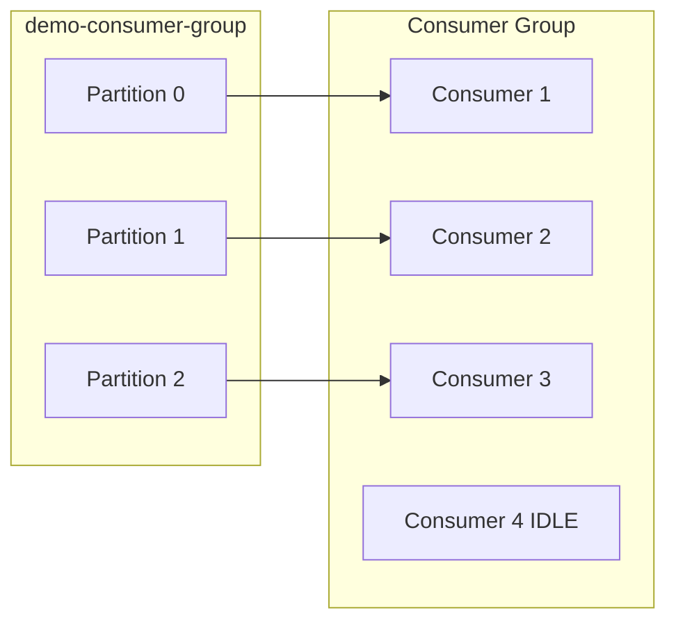

# Kafka Consumer Group & Chia sẻ tải

Tài liệu này mô tả **Consumer Group**, cách Kafka **chia partition** cho nhiều consumer, và bài thực hành:

- Topic `**demo-consumer-group`** với **3 partitions**
- Bật **4 consumer** trong **cùng một Consumer Group**
- Quan sát **Consumer thứ 4 có bị idle không** và **tại sao**

en-sub: This document describes the Consumer Group, how Kafka distributes partitions across multiple consumers:

- Topic demo-consumer-group with 3 partitions
- Run 4 consumers within the same Consumer Group.
- Check whether the 4th consumer stays idle and why.

---

## 1. Consumer Group là gì?

**Consumer Group** là một nhóm các consumer instance cùng `group.id`, **chia sẻ** việc đọc một topic:

- Mỗi **partition** của topic chỉ được **một** consumer trong group xử lý tại một thời điểm
- Message trong cùng partition được đọc tuần tự bởi consumer được assign partition đó
- Offset tiến độ được lưu theo **group** (trong topic nội bộ `__consumer_offsets`)

en-sub: Consumer group is a groups consumers instance same group.id, sharding read a topic: 

- Each partition of topic only be assigned to one consumer in the group handle at a time
- Message within the same (in the same)  are read sequentially by the consumer assigned to that partition
- Offset progress is stored per Consumer Group in the internal topic __consumer_offsets.

```
Topic: demo-consumer-group (3 partitions)
Consumer Group: full-node-consumer-group-demo

Partition 0 ──► Consumer 1
Partition 1 ──► Consumer 2
Partition 2 ──► Consumer 3
Consumer 4    ──► (không có partition) → IDLE
```

### So sánh nhanh


|           | Cùng Consumer Group        | Khác Consumer Group                |
| --------- | -------------------------- | ---------------------------------- |
| Partition | Chia nhau, không trùng     | Mỗi group đọc **toàn bộ** topic    |
| Offset    | Chung theo group           | Riêng từng group                   |
| Use case  | Scale xử lý (load sharing) | Broadcast / nhiều ứng dụng độc lập |


---

## 2. Chia sẻ tải (Load balancing)

Khi produce message **không key** (round-robin), message phân bổ đều qua các partition. Consumer group **phân công** mỗi consumer đọc một hoặc vài partition:

en-sub: When produce message haven't key (round robin), message are distributed evenly across partitions (Messages are evenly distributed among partitions). Consumer group assign each consumer read one or several partition


| Số partition (P) | Số consumer trong group (C) | Kết quả                             |
| ---------------- | --------------------------- | ----------------------------------- |
| P = 3            | C = 1                       | 1 consumer đọc cả 3 partition       |
| P = 3            | C = 3                       | Mỗi consumer 1 partition (lý tưởng) |
| P = 3            | C = 4                       | **3 active**, **1 idle**            |
| P = 6            | C = 3                       | Mỗi consumer ~2 partition           |


**Quy tắc cốt lõi:**

```
Số consumer đang làm việc ≤ min(P, C)
Số consumer idle = max(0, C - P)   (khi C > P)
```

Với demo **P = 3**, **C = 4** → **1 consumer idle** (thường là consumer join sau cùng hoặc không được assign partition trong lần rebalance đó).

---

## 3. Tại sao Consumer thứ 4 bị IDLE?

Kafka dùng **cooperative / range assignor** (mặc định broker) để map partition → consumer trong group:

1. Mỗi partition chỉ gán cho **một** member
2. Chỉ có **3 partition** → tối đa **3 assignment**
3. Consumer thứ 4 vẫn **join group** (heartbeat, sẵn sàng rebalance) nhưng `**memberAssignment` rỗng** → không fetch message

Consumer idle **không phải lỗi** — đó là cơ chế dự phòng:

- Khi một consumer **crash**, partition được **reassign** cho consumer idle
- Khi **scale down** rồi **scale up**, idle consumer có thể nhận lại partition

> **Lưu ý kafkajs:** Phiên bản ≥ 2.0.1 đã sửa bug consumer không được assign partition có thể thoát group vĩnh viễn. Project dùng `kafkajs@^2.2.4`.

en-sub: 

Kafka uses the cooperative/ range assignor (default broker) to map partition to consumers within a consumer group:

- Each partition can only be assigned to one a member
- There are only 3 partitions -> maximum 3 assignment
- The 4th consumer still joins the group (sending heartbeat and ready for rebalance), but its memberAssignment is empty → it cannot fetch messages

An idle consumer is not a bug - it is part of the failover mechanism:

- When a consumer crash, partition are reassigned to the idle consumer.
- When scaling down and scaling up again, the idle consumer may receive partitions later .

KafkaJS note:  
Versions >= 2.0.1 fixed an issue where a consumer without assigned partitions could permanently leave the group. This project uses kafkajs@^2.2.4.

---

## 4. Rebalance

Khi số lượng consumer trong group thay đổi (start/stop/crash), Kafka **rebalance**:

1. Tạm dừng consume (revoke partition cũ)
2. Phân chia lại partition cho toàn group
3. Tiếp tục đọc từ offset đã commit

Script demo log sự kiện `**GROUP_JOIN`** (kafkajs instrumentation) để thấy partition được gán sau mỗi lần join/sync.

en-sub: 

When the number of consumers in the group changes (start/stop/crash), kafka triggers a rebalance:

- stop consume (revoke old partition)

---

## 5. Cấu hình trong project


| Biến môi trường               | Mặc định                        | Ý nghĩa                 |
| ----------------------------- | ------------------------------- | ----------------------- |
| `KAFKA_GROUP_TOPIC`           | `demo-consumer-group`           | Topic demo 3 partitions |
| `KAFKA_GROUP_PARTITION_COUNT` | `3`                             | Số partition            |
| `KAFKA_GROUP_ID`              | `full-node-consumer-group-demo` | Consumer group id       |


---

## 6. Cấu trúc code

```
backend/scripts/consumer-group/   # Demo CLI (tài liệu này)
├── setup.ts          # Tạo topic 3 partitions
├── produce.ts        # Produce round-robin
├── consume.ts        # 1 consumer (tham số id 1–4)
├── consume-all.ts    # 4 consumer trong 1 process
└── describe.ts       # Mô tả assignment qua Admin API
```

> REST API không dùng cho demo này — chỉ script CLI, giống `[scripts/partition/](../scripts/partition/)`.

---

## 7. Tạo Topic 3 Partitions

```bash
cd backend
npm run kafka:up
npm run kafka:group:setup
```

Output mẫu:

```
[setup] Created topic "demo-consumer-group" with 3 partition(s)
[setup] partition=0 leader=1
[setup] partition=1 leader=1
[setup] partition=2 leader=1
```

---

## 8. Bật 4 Consumer cùng Group

### Cách 1: Bốn terminal (giống môi trường thật)

Mở **4 terminal**, mỗi terminal một consumer **cùng** `KAFKA_GROUP_ID`:

```bash
npm run kafka:group:consume -- 1
npm run kafka:group:consume -- 2
npm run kafka:group:consume -- 3
npm run kafka:group:consume -- 4
```

Khi `GROUP_JOIN`, output mẫu:

```
[consumer-1] Assigned partition(s): 0
[consumer-2] Assigned partition(s): 1
[consumer-3] Assigned partition(s): 2
[consumer-4] Assigned partition(s): (none — consumer is IDLE)
[consumer-4] ⚠ IDLE: no partition assigned (consumers > partitions in group)
```

Thứ tự partition cụ thể (0,1,2) có thể khác tùy rebalance; điều quan trọng là **đúng 3 consumer active** và **1 idle**.

### Cách 2: Một lệnh (quan sát nhanh)

```bash
npm run kafka:group:consume-all
```

Chạy 4 instance consumer trong một process Node — vẫn cùng group, Kafka coi là 4 member.

### Kiểm tra group qua Admin API

```bash
npm run kafka:group:describe
```

Output mẫu:

```
[describe] Topic: demo-consumer-group (3 partition(s))
[describe] Consumer group: full-node-consumer-group-demo
[describe] Members: 4
  member #1 clientId=consumer-group-demo-1 → partitions [0]
  member #2 clientId=consumer-group-demo-2 → partitions [1]
  member #3 clientId=consumer-group-demo-3 → partitions [2]
  member #4 clientId=consumer-group-demo-4 → IDLE (no partitions)
[describe] Rule: at most 3 consumer(s) get work; extra members stay IDLE.
```

---

## 9. Produce message và quan sát phân phối

Sau khi consumer đã join group:

```bash
npm run kafka:group:produce
npm run kafka:group:produce -- 15
```

Chỉ **3 consumer có partition** in log xử lý message; **consumer-4** không in dòng `partition=...` (trừ khi rebalance xảy ra và nó được assign).

Ví dụ (rút gọn):

```
[consumer-1] partition=0 offset=0 value="msg-1"
[consumer-2] partition=1 offset=0 value="msg-2"
[consumer-3] partition=2 offset=0 value="msg-3"
[consumer-1] partition=0 offset=1 value="msg-4"
...
```

---

## 10. Phân tích kết quả demo

### Kết luận bài lab


| Câu hỏi                     | Trả lời                                                                             |
| --------------------------- | ----------------------------------------------------------------------------------- |
| Consumer 4 có idle?         | **Có** (không được assign partition)                                                |
| Tại sao?                    | Chỉ có **3 partition**, mỗi partition tối đa **1 consumer** trong group             |
| Consumer 4 vô dụng?         | **Không** — standby khi rebalance / consumer khác chết                              |
| Muốn 4 consumer đều active? | Tăng partition lên **≥ 4** (ví dụ `KAFKA_GROUP_PARTITION_COUNT=4` và tạo lại topic) |


### Sơ đồ assignment (P=3, C=4)




### Scale partition để tận dụng thêm consumer


| Partition | Consumer trong group | Idle                                  |
| --------- | -------------------- | ------------------------------------- |
| 3         | 4                    | 1                                     |
| 4         | 4                    | 0                                     |
| 6         | 4                    | 0 (mỗi consumer có thể 1–2 partition) |


---

## 11. Workflow end-to-end

```bash
# 1. Kafka
npm run kafka:up

# 2. Topic 3 partitions
npm run kafka:group:setup

# 3a. Bốn consumer (4 terminal) HOẶC 3b. một lệnh
npm run kafka:group:consume -- 1
# ... 2, 3, 4
# hoặc: npm run kafka:group:consume-all

# 4. Produce
npm run kafka:group:produce

# 5. (Tuỳ chọn) Xem assignment
npm run kafka:group:describe

# 6. Kafka UI: http://localhost:8080 → Consumers → group id
```

Chi tiết script: `[scripts/consumer-group/README.md](../scripts/consumer-group/README.md)`

---

## 12. Script tổng hợp


| Lệnh                          | Mô tả                           |
| ----------------------------- | ------------------------------- |
| `kafka:group:setup`           | Tạo topic 3 partitions          |
| `kafka:group:produce`         | Produce N message (round-robin) |
| `kafka:group:consume -- <id>` | Một consumer (id 1–16)          |
| `kafka:group:consume-all`     | 4 consumer trong một process    |
| `kafka:group:describe`        | In assignment của group         |


---

## 13. Thực hành mở rộng

1. **Dừng consumer-1** (Ctrl+C) → chạy lại hoặc để consumer-4 nhận partition — quan sát rebalance
2. **Chỉ 2 consumer** → mỗi consumer có thể nhận 2 partition (range assignor)
3. **Tăng partition lên 4** — xóa topic, `setup` lại với `KAFKA_GROUP_PARTITION_COUNT=4`, chạy 4 consumer → không còn idle

Xóa topic:

```bash
docker exec -it full-node-kafka /opt/kafka/bin/kafka-topics.sh \
  --bootstrap-server localhost:9092 \
  --delete --topic demo-consumer-group
```

---

## 14. Troubleshooting


| Vấn đề                          | Nguyên nhân                                       | Cách xử lý                                          |
| ------------------------------- | ------------------------------------------------- | --------------------------------------------------- |
| Cả 4 consumer đều đọc message   | Khác `group.id` hoặc khác topic                   | Kiểm tra `KAFKA_GROUP_ID`, cùng topic               |
| Không thấy IDLE                 | Chỉ chạy 3 consumer                               | Chạy consumer thứ 4                                 |
| Consumer 4 đôi khi có partition | Rebalance sau khi consumer khác thoát             | Bình thường — quan sát `GROUP_JOIN`                 |
| Không có message                | Produce trước khi consumer join, offset đã commit | `fromBeginning: true` trong script hoặc produce lại |
| Topic 1 partition               | Topic tạo trước với 1 partition                   | Xóa topic, chạy lại `kafka:group:setup`             |


---

## 15. Liên quan

- `[kafka1.md](./kafka1.md)` — setup Kafka, produce/consume cơ bản, giới thiệu Consumer Group
- `[kafka2.md](./kafka2.md)` — partition, offset, round-robin producer
- `[kafka3.md](./kafka3.md)` — consumer group & chia sẻ tải (tài liệu này)
- `[scripts/README.md](../scripts/README.md)` — index demo scripts

---

## 16. Tài liệu tham khảo

- [Kafka Consumer Groups](https://kafka.apache.org/documentation/#consumerconfigs)
- [kafkajs — Consumer](https://kafka.js.org/docs/consuming)
- [kafkajs — Instrumentation GROUP_JOIN](https://kafka.js.org/docs/instrumentation-events#consumer)

